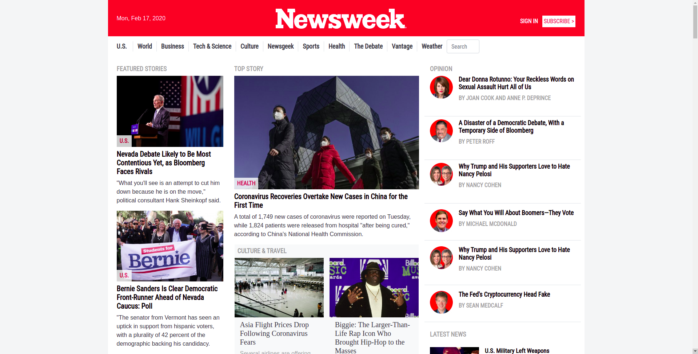

# The News Week Clone

> The purpose of this project is to learn about media queries and responsive design with bootstrap.  
> The News Week website is quiet a complex one with, varying layouts, which makes it quiet challenging and educative as well. I really enjoyed working on this project.

## Built With

- HTML
- CSS
- Bootstrap

## Live Demo

[Live Demo Link](https://rawcdn.githack.com/appiersign/news-week/88df57284b6785d9485b6be3ba43548e0fb765de/index.html)

## Authors

👤 **Solomon Appier-Sign**

- Github: [@githubhandle](https://github.com/appiersign)
- Twitter: [@appiersign](https://twitter.com/appiersign)
- Linkedin: [linkedin](https://www.linkedin.com/in/solomon-appier-sign/)

## 🤝 Contributing

This project is for educational purposes only, suggestions are accepted, but no contributions.

## Show Your Support

Kindly give me a star if you like this project
